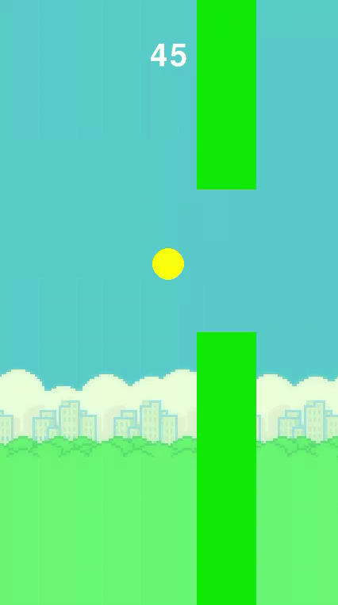

# NeatFlappyBird

<p align="center">
  
</p>

A Flappy Bird clone built with [pygame-ce](https://pyga.me/) where a Neural Network
is trained to play the game using
[NEAT](https://neat-python.readthedocs.io/) (NeuroEvolution of Augmenting Topologies).

Two entry points:

- `train.py` - evolves a population of birds with NEAT and saves the best genome.
- `game.py` - you play against the trained AI bird.

## Requirements

- Python 3.10+ (developed on Python 3.14)
- `neat-python==2.0.0`
- `numpy==2.4.6`
- `pygame-ce==2.5.7`

## Setup

```bash
git clone https://github.com/wmstevenson/NeatFlappyBird.git
cd NeatFlappyBird

python3 -m venv venv
source venv/bin/activate        # Windows: venv\Scripts\activate

pip install -r requirements.txt
```

If `requirements.txt` gives you trouble, install the packages directly:

```bash
pip install neat-python==2.0.0 numpy==2.4.6 pygame-ce==2.5.7
```

## Running

### 1. Train the AI

```bash
python train.py
```

This runs the NEAT population and saves the best bird to best_genome.pkl in the project root. You can watch the population learn in the game window. Training runs for up to 25 generations, and stops early if the population reaches a score of 100. 

### 2. Play against the AI

```bash
python game.py
```

This loads `best_genome.pkl`, so **run training at least once first** (or place a `best_genome.pkl` in the project root). You control the yellow bird; the magenta bird is the trained AI.

**Controls:** press `Space` to flap. Close the window to quit.

## Project structure

| File | Purpose |
| --- | --- |
| `train.py` | Trains the NEAT population and saves `best_genome.pkl`. |
| `game.py` | Playable version: you vs. the trained AI. |
| `bird.py` | The `Bird` class (physics, drawing, collision box). |
| `pipe.py` | The `Pipe` class (spawning, movement, rectangles). |
| `config.txt` | NEAT configuration (population size, mutations, etc.). |
| `bg.png` | Background image (required). |
| `requirements.txt` | Python dependencies. |

## Notes

- `bg.png` must be present in the project root; the game loads it at startup.
- `best_genome.pkl` is generated by training and is required by `game.py`.
- Run both scripts from the project root so the assets resolve correctly.
